<a name="readme-top"></a>


<!--
*** I'm using markdown "reference style" links for readability.
*** Reference links are enclosed in brackets [ ] instead of parentheses ( ).
*** See the bottom of this document for the declaration of the reference variables
*** https://www.markdownguide.org/basic-syntax/#reference-style-links
-->


<!-- PROJECT LOGO -->
<br />
<div align="center">
  <a href="https://github.com/advanced-computer-lab-2023/MangoDB-Clinic">
    
  </a>

  <h1 align="center">MangoDB Virtual Clinic</h1>
  <h4 align="center">
    Next-Level Care, One Click Away
  </h4>
</div>


<!-- TABLE OF CONTENTS -->
<details>
  <summary>Table of Contents</summary>
  <ol>
    <li>
      <a href="#about-the-project">About The Project</a>
      <ul>
        <li><a href="#description">Description</a></li>
        <li>
            <a href="#features">Features</a>
        </li> 
        <li><a href="#screenshots">Screenshots</a></li>
        <li><a href="#built-with">Built With</a></li>
        <li><a href="#build-status">Build Status</a></li>
      </ul>
    </li>
    <li>
      <a href="#getting-started">Getting Started</a>
      <ul>
        <li><a href="#prerequisites">Prerequisites</a></li>
        <li><a href="#installation">Installation</a></li>
        <li><a href="#usage">Usage</a></li>
      </ul>
    </li>
    <li><a href="#running-tests">Running Tests</a></li>
    <li><a href="#code-specifcations">Code Specifcations</a></li>
    <li><a href="#generate-api-documentation">Generate API Documentation</a></li>
    <li><a href="#contributing">Contributing</a></li>
    <li><a href="#credits">Credits</a></li>
    <li><a href="#license">License</a></li>
  </ol>
</details>


<!-- ABOUT THE PROJECT -->
## About The Project

### Description 🧾

MangoDB Virtual Clinic is a comprehensive virtual healthcare platform that bridges the gap between patients, doctors, and administrators. Our platform is built on the principles of accessibility, efficiency, and security, ensuring that every interaction within the healthcare ecosystem is seamless and beneficial. The platform offers a user-friendly interface for patients to manage their health records, schedule appointments, and avail of exclusive discounts on medicines through subscription packages. Doctors, on the other hand, have tools to efficiently manage prescriptions, appointments, and patient interactions.

<p align="right">(<a href="#readme-top">back to top</a>)</p>

### Features ✨
<details>
<summary><strong>Patient-Centric Features:</strong></summary>

1. *User Registration and Authentication:*
    - Securely register as a patient with authentication mechanisms to protect user information.
    - Easily change your passowrd anytime.

2. *Doctor Interaction:*
    - View profiles of all available doctors.
    - Conduct video calls with doctors for remote consultations.
    - Engage in two-way communication with healthcare providers through secure messaging.

3. *Convenient Appointment Scheduling:*
    - Schedule appointments with available doctors.
    - Receive automated reminders through our system or by mail well in advance to ensure you never miss a scheduled appointment. 
    - Receive instant notifications in-app and via email if there are any changes to your scheduled appointments.

4. *Subscription Packages:*
    - Subscribe to yearly packages for exclusive discounts on medicines and additional perks.
    - Link family members to extend benefits to them.  

5. *Prescription Management:*
   - View and manage all prescriptions written by doctors.
   - Download your prescription for easy access.

6. *Wallet for Hassle-Free Payments:*
   - Utilize a wallet for easy and secure payments within the platform.

7. *Personalized Health Records:*
    - Store and manage your health records in a centralized and secure environment.
    - Access your medical history anytime, anywhere, facilitating informed decision-making.

<!-- <p align="right">(<a href="#readme-top">back to top</a>)</p> -->
</details>

<details>
<summary><strong>Doctor-Empowering Tools:</strong></summary>

1. *Streamlined Prescription Management:*
   - View all prescriptions written for patients.
   - Modify prescriptions as needed.

2. *Patient Interaction Hub:*
   - View a list of all patients with whom at least one appointment has been scheduled.
   - Streamline communication and follow-up care through video calls for enhanced patient outcomes.
   - Engage in real-time chat conversations with patients with whom you have scheduled appointments.

3. *Efficient Appointment Management:*
    - Organize and manage appointments efficiently, optimizing the doctor's schedule.
    - View upcoming appointments.

4. *Notifications System:*
    - Be promptly informed about cancellations or rescheduling to adapt your plans accordingly.
    - Utilize our user-friendly interface to view updated appointment details and take necessary actions.

</details>

<details>
<summary><strong>Administrator Oversight:</strong></summary>

1. *Centralized System Control:*
    - Administrators have a powerful interface to oversee and manage all aspects of the MangoDB Virtual Clinic.
    - Ensure compliance, security, and seamless operation of the entire healthcare platform.

2. *Analytics and Reporting:*
    - Leverage comprehensive analytics to gain insights into user engagement, appointment trends, and overall system performance.
    - Generate detailed reports to inform strategic decisions and enhance the overall user experience.

</details>


### Screenshots 📸


<details>
<summary>Landing Page</summary>
  

    
</details>

<details>
<summary>List Of Doctors</summary>
  

    
</details>

<details>
<summary>Doctor's HomePage</summary>
  
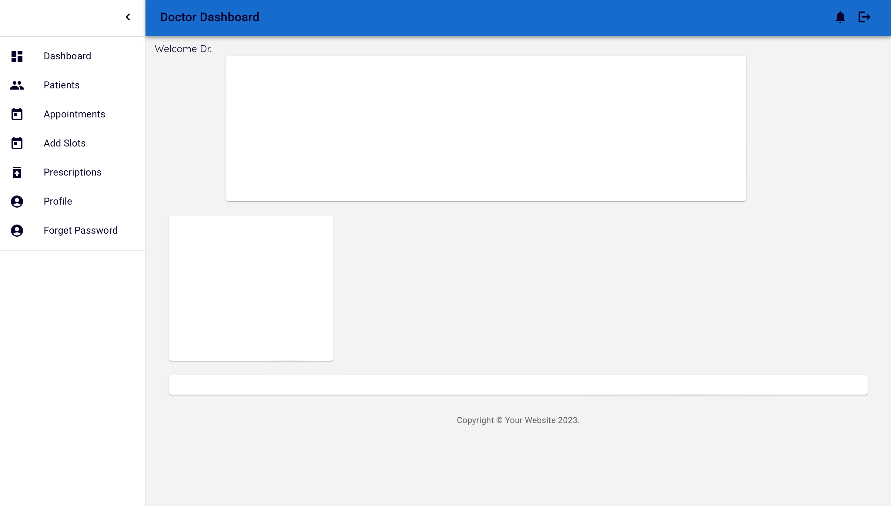
    
</details>

<details>
<summary>Doctor's Appointments</summary>
  
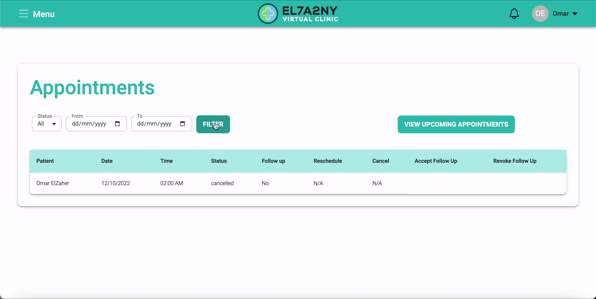
    
</details>

<details>
<summary>Doctor's Registration</summary>
  
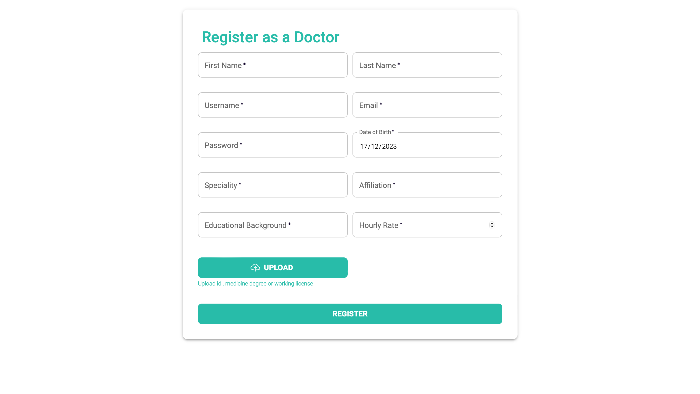
    
</details>

<details>
<summary>Patient's Packages</summary>
  
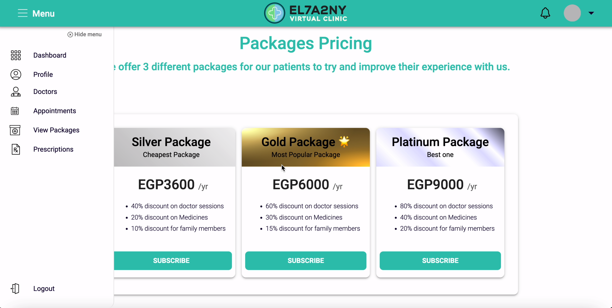
    
</details>

<details>
<summary>Patient's Appointments</summary>
  
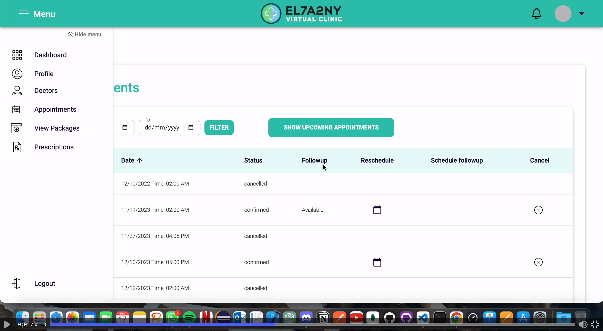
    
</details>


### Built With 🛠️

*Tech/Framework used:*

<!-- * [![Next][Next.js]][Next-url] -->
* [![Node][Node.js]][Node-url]
* [![React][React.js]][React-url]
* [![Express][Express.js]][Express-url]
* [![Mui][Material-ui]][Material-ui-url]
* [![Mongo][MongoDB]][MongoDB-url]
* [![JWT][Jsonwebtokens]][Jsonwebtokens-url]
* [![Stripe][Stripe]][Stripe-url]
* [![Figma][Figma]][Figma-url]
* [![VScode][VScode]][VScode-url]
* [![Postman][Postman]][Postman-url]
* [![Github][Github]][Github-url]
* [![Git][Git]][Git-url]
*  

### Build Status 

<ul>
   <li>The project is currently in development.</li>
   <li>Unit Tests needs to be implemented.</li>
   <li>Some input fields are case senstive.</li>
   <li>Cookies may be implemented for smoother operations.</li>
   <li>Files sizes too large due to redundant code and could be more organized.</li>
   <li>The use of comments may be increased to aid in future maintenance.</li>
   <li>Ui could be improved.</li>
   <li>There may bugs that isn't found yet.</li>
<ul>


<p align="right">(<a href="#readme-top">back to top</a>)</p>

<!-- GETTING STARTED -->
## Getting Started

To set up MangoDB Virtual Clinic locally and start exploring its features, follow these simple steps:

### Prerequisites

Before you begin, make sure you have the following installed on your machine:

- [Node.js](https://nodejs.org/) - Ensure Node.js is installed to run the application.
- [MongoDB](https://www.mongodb.com/try/download/community) - Set up a MongoDB database to store application data.
- [VScode](https://code.visualstudio.com) - Install any IDE to run the project on.
- [Stripe](https://stripe.com) - Head to Stripe and get your Stipe private key.

### Installation 📥

1. **Clone the repo**
   ```sh
   git clone https://github.com/advanced-computer-lab-2023/MangoDB-Clinic.git
   ```
2. **Navigate to the project directory:**
   ```sh
   cd MangoDB-Clinic
   ```
3. **Install NPM packages**
   ```sh
   npm install
   ```
4. **Navigate to the frontend folder:**
   ```sh
   cd frontned
   ```
5. **Install NPM packages**
   ```sh
   npm install
   ```
6. **Create a .env File:**

   In the root directory of MangoDB Virtual Clinic, create a `.env` file with the following content:

   ```js
    # MongoDB Connection URI
    MONGO_URI="your_mongodb_url"

    # JSON Web Token Secret
    JWT_SECRET="your_secure_passphrase"

    # Stripe Private Key
    STRIPE_PRIVATE_KEY="your_stripe_private_key" 
   ```
   Make sure to replace the placeholder values with your actual MongoDB connection URL, a secure passphrase for JWT, and your Stripe private key.

   **Note**: Keep your `.env file secure and never expose it to the public. It contains sensitive information required for the proper functioning of MangoDB Virtual Clinic.

8. **Navigate Back to the Root Directory:**

   After creating the `.env` file, navigate back to the root directory of MangoDB Virtual Clinic:

   ```bash
   cd ..

9. **Run the Application:**
   ```sh
   npm run dev
   ```
    This command will launch MangoDB Virtual Clinic with the specified configurations from your .env file. Access the application in your web browser at http://localhost:3000.

    **Note**: Ensure that MongoDB is running and accessible before starting the application.


<p align="right">(<a href="#readme-top">back to top</a>)</p>


<!-- USAGE EXAMPLES -->
### Usage

Experience the MangoDB Virtual Clinic by following these simple steps:

1. **Open your Web Browser:**
   - Launch your preferred web browser.

2. **Visit MangoDB Virtual Clinic:**
   - Go to [http://localhost:3000](http://localhost:3000) to access the MangoDB Virtual Clinic platform.

3. **Register Your Account:**
   - Sign up as either a patient or a doctor to unlock the platform's rich features.

4. **Explore the Patient Dashboard:**
   - Dive into the intuitive patient dashboard to seamlessly manage your health journey.

5. **Schedule Appointments:**
   - Use the scheduling feature to book appointments with your chosen healthcare professional.

6. **Manage Prescriptions:**
   - Keep track of your prescriptions, and easily modify or renew them when needed.

7. **Exclusive Subscription Packages:**
   - Explore and subscribe to exclusive yearly packages for discounts on medicines and additional perks.

8. **For Doctors: Efficiently Manage Appointments:**
   - Access tools to manage appointments efficiently, ensuring optimal scheduling and patient care.

9. **For Doctors: Streamlined Prescription Management:**
   - View and modify prescriptions with ease, providing accurate and up-to-date medical information.

10. **For Doctors: Engage with Patients:**
    - View patient interactions and communicate effectively to enhance overall healthcare outcomes.

**Note**: To gain full experience try first filling the database with doctors and patients so you can see all the features.

<p align="right">(<a href="#mangodb-virtual-clinic">back to top</a>)</p>


## Running Tests

The testing is done using [Postman](https://www.postman.com)
**Note:**For testing any GET, PUT, 

<details>
<summary><strong>Login test:</strong></summary>

You should register first a doctor or a patient to test the Login
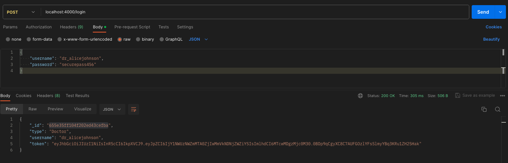

</details>

<details>
<summary><strong>Prescriptions test:</strong></summary>
Enter the token you got from the login in bearer auth in postman

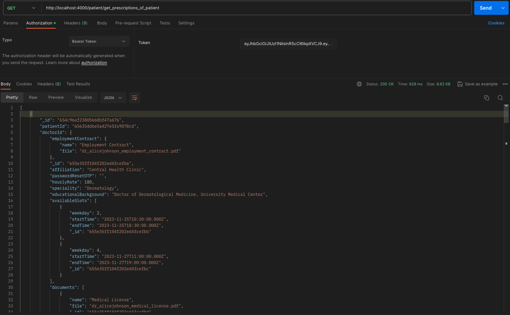

**Note**: You may get an empty array in case there are no prescriptions.
</details>

<details>
<summary><strong>add Prescription:</strong></summary>

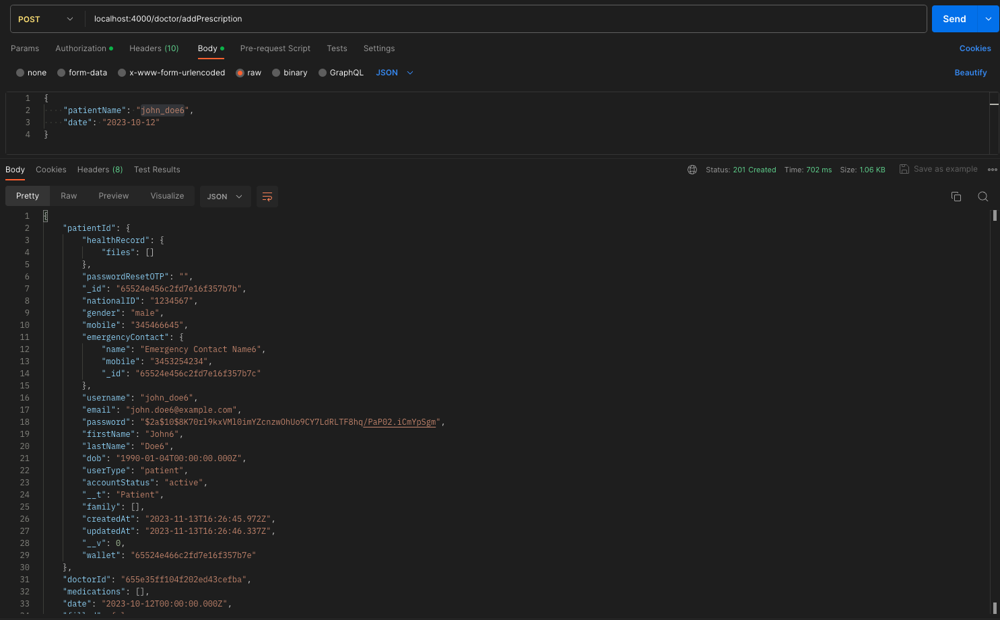

</details>

<details>
<summary><strong>Check Patient's health package test:</strong></summary>

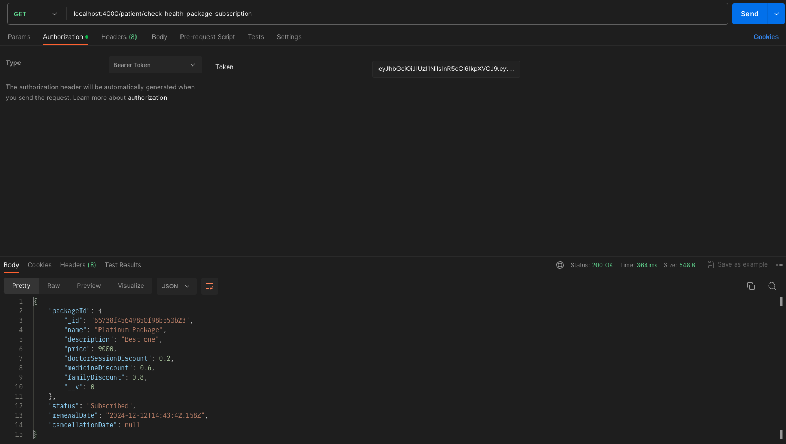

</details>

<details>
<summary><strong>Get Family Members test:</strong></summary>


</details>

<details>
<summary><strong>Add Family Members test:</strong></summary>

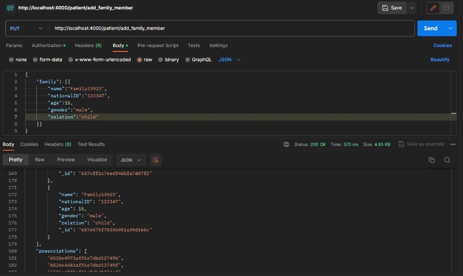

</details>

<details>
<summary><strong>Filter Doctors test:</strong></summary>

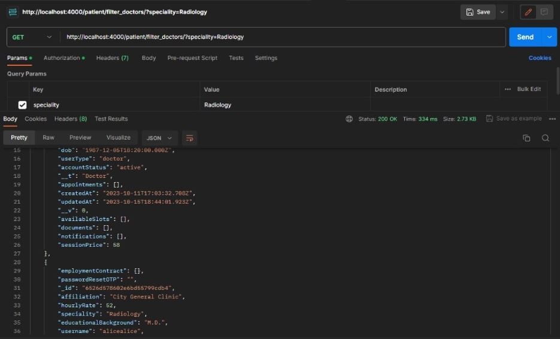

</details>

<!-- ROADMAP -->
## Code Specifcations ⚙️

<details>
<summary><strong>Structure:</strong></summary>

```bash
.
├── README.md
├── backend
│ ├── config
│ │ └── db.js
│ ├── controllers
│ │ ├── adminController.js
│ │ ├── doctorController.js
│ │ ├── guestController.js
│ │ └── patientController.js
│ ├── middleware
│ │ ├── adminMiddleware.js
│ │ ├── authMiddleware.js
│ │ ├── doctorMiddleware.js
│ │ ├── errorMiddleware.js
│ │ ├── patientMiddleware.js
│ │ ├── stripeMiddleware.js
│ │ └── upload.js
│ ├── models
│ │ ├── adminModel.js
│ │ ├── appointmentModel.js
│ │ ├── doctorModel.js
│ │ ├── packagesModel.js
│ │ ├── patientModel.js
│ │ ├── prescriptionModel.js
│ │ ├── userModel.js
│ │ └── walletModel.js
│ ├── routes
│ │ ├── adminRoutes.js
│ │ ├── doctorRoutes.js
│ │ ├── guestRoutes.js
│ │ └── patientRoutes.js
│ ├── server.js
│ └── views
│ ├── addFamilyMember.ejs
│ ├── adminDashboard.ejs
│ ├── doctorHomePage.ejs
│ ├── doctorRegistration.ejs
│ ├── patientDashboard.ejs
│ ├── patientRegistration.ejs
│ ├── selectedPatient.ejs
│ └── viewAllPatients.ejs
├── frontend
│ ├── README.md
│ ├── package-lock.json
│ ├── package.json
│ ├── public
│ │ ├── favicon.ico
│ │ ├── icons
│ │ │ ├── accept.svg
│ │ │ ├── add.svg
│ │ │ ├── addMember.svg
│ │ │ ├── address.svg
│ │ │ ├── appointment.svg
│ │ │ ├── approvedDocument.svg
│ │ │ ├── call.svg
│ │ │ ├── cart.svg
│ │ │ ├── certificate.svg
│ │ │ ├── chart.svg
│ │ │ ├── chat.svg
│ │ │ ├── clinic.svg
│ │ │ ├── clinicLogo.svg
│ │ │ ├── clinicLogo2.svg
│ │ │ ├── clinicalDocument.svg
│ │ │ ├── clinicalRecord.svg
│ │ │ ├── creditCard.svg
│ │ │ ├── dashboard.svg
│ │ │ ├── date.svg
│ │ │ ├── defaultLogo.svg
│ │ │ ├── deniedDocument.svg
│ │ │ ├── editDocument.svg
│ │ │ ├── family.svg
│ │ │ ├── familyFolder.svg
│ │ │ ├── filter.svg
│ │ │ ├── finance.svg
│ │ │ ├── healthPackage.svg
│ │ │ ├── index.js
│ │ │ ├── info.svg
│ │ │ ├── login.svg
│ │ │ ├── logoEmblem.svg
│ │ │ ├── logout.svg
│ │ │ ├── meds.svg
│ │ │ ├── medsV2.svg
│ │ │ ├── menu.svg
│ │ │ ├── mobile.svg
│ │ │ ├── notes.svg
│ │ │ ├── notifications.svg
│ │ │ ├── password.svg
│ │ │ ├── patient.svg
│ │ │ ├── person.svg
│ │ │ ├── pharmacist.svg
│ │ │ ├── pharmacy.svg
│ │ │ ├── pharmacyLogo.svg
│ │ │ ├── pharmacyLogo2.svg
│ │ │ ├── preferences.svg
│ │ │ ├── prescription.svg
│ │ │ ├── profile.svg
│ │ │ ├── reject.svg
│ │ │ ├── remove.svg
│ │ │ ├── search.svg
│ │ │ ├── secure.svg
│ │ │ ├── settings.svg
│ │ │ ├── tabIcon.png
│ │ │ ├── ticket.svg
│ │ │ ├── upload.svg
│ │ │ ├── wallet.svg
│ │ │ └── warning.svg
│ │ ├── index.html
│ │ ├── logo192.png
│ │ ├── logo512.png
│ │ ├── manifest.json
│ │ └── robots.txt
│ └── src
│ ├── App.css
│ ├── App.js
│ ├── App.test.js
│ ├── components
│ │ ├── AccountBalance.js
│ │ ├── Admin
│ │ │ ├── AddAdmin.jsx
│ │ │ ├── AddPackage.jsx
│ │ │ ├── AdminDashboard.jsx
│ │ │ ├── ChangePasswordAdmin.jsx
│ │ │ ├── Chart.jsx
│ │ │ ├── DateCard.jsx
│ │ │ ├── EditHealthPackage.jsx
│ │ │ ├── ForgotPasswordAdmin.jsx
│ │ │ ├── HealthPackages.jsx
│ │ │ ├── LoginAdmin.jsx
│ │ │ ├── RemoveAdmin.jsx
│ │ │ ├── RemoveDoctor.jsx
│ │ │ ├── RemovePatient.jsx
│ │ │ ├── RequestedDoctors.jsx
│ │ │ ├── RequestedDoctorsTable.jsx
│ │ │ ├── Title.jsx
│ │ │ ├── UserManagement.jsx
│ │ │ └── listItems.jsx
│ │ ├── ChangePasswordDoctor.js
│ │ ├── Dashboard.js
│ │ ├── Doctor
│ │ │ ├── DoctorForm.js
│ │ │ ├── DoctorListItems.js
│ │ │ └── Reschedule.js
│ │ ├── DoctorDetails.js
│ │ ├── DoctorSearch.js
│ │ ├── DoctorsTable.js
│ │ ├── Filter.js
│ │ ├── GeneralComponents
│ │ │ ├── ForgotPasswordUser.jsx
│ │ │ ├── LoginUser.jsx
│ │ │ ├── PrescriptionsTable.js
│ │ │ └── Spinner.jsx
│ │ ├── NavBar.js
│ │ ├── Patient
│ │ │ ├── ChangePasswordPatient.js
│ │ │ ├── Notification.js
│ │ │ ├── PatientForm.js
│ │ │ └── patientListItems.js
│ │ ├── PrescriptionDetails.jsx
│ │ └── ReusableTable2.js
│ ├── index.css
│ ├── index.js
│ ├── pages
│ │ ├── AddHealthRecordsPatient.js
│ │ ├── AddSlots.js
│ │ ├── Admin
│ │ │ ├── AddAdminPage.jsx
│ │ │ ├── AddPackagePage.jsx
│ │ │ ├── ChangePasswordPage.jsx
│ │ │ ├── DashboardPage.jsx
│ │ │ ├── EditHealthPackagePage.jsx
│ │ │ ├── ForgotPasswordAdminPage.jsx
│ │ │ ├── HealthPackagesPage.jsx
│ │ │ ├── LoginAdminPage.jsx
│ │ │ ├── RemoveAdminPage.jsx
│ │ │ ├── RemoveDoctorPage.jsx
│ │ │ ├── RemovePatientPage.jsx
│ │ │ ├── RequestedDoctorsPage.jsx
│ │ │ └── UserManagementPage.jsx
│ │ ├── Cancel.js
│ │ ├── Checkout.js
│ │ ├── Doctor
│ │ │ ├── ChangePasswordDoctorPage.js
│ │ │ ├── DoctorApps.js
│ │ │ ├── EditDoctor.js
│ │ │ ├── PatientDetails.js
│ │ │ ├── PatientList.js
│ │ │ ├── ViewPrescriptionsDoctor.js
│ │ │ └── doctorDashboard.jsx
│ │ ├── General
│ │ │ ├── ForgotPasswordUserPage.jsx
│ │ │ └── LoginUserPage.jsx
│ │ ├── Home.js
│ │ ├── LinkFamMember.js
│ │ ├── LinkPatientAsFam.js
│ │ ├── Patient
│ │ │ ├── ChangePasswordPatientPage.js
│ │ │ ├── PatientDashboard.jsx
│ │ │ ├── ViewPackagesPatient.js
│ │ │ └── ViewPrescriptionsPatient.js
│ │ ├── PrescriptionDetails.js
│ │ ├── Success.js
│ │ ├── ViewAppointments.js
│ │ ├── ViewDoctors.js
│ │ ├── ViewEmploymentContract.js
│ │ ├── ViewFamilyMembers.js
│ │ ├── ViewHealthRecordsPat.js
│ │ ├── ViewPackages.js
│ │ ├── ViewProfile.js
│ │ ├── ViewWallet.js
│ │ ├── cancelHealthPackageSubscription.js
│ │ ├── successfulPackagePayment.js
│ │ └── viewHealthPackageSubscription.js
│ ├── reportWebVitals.js
│ ├── services
│ │ └── api.js
│ ├── setupTests.js
│ ├── theme.js
│ └── useFetch.js
├── package-lock.json
├── package.json
├── readme_images
│ ├── clinicLogo.svg
│ ├── dailyco.png
│ ├── doctorDashboard.png
│ ├── homepage.png
│ └── pateintDashboard.png
└── uploads
└── placeholderImg.jpeg
```

</details>

<details>
<summary><strong>Styles 🪄: </strong></summary>
<ul>
      <li><strong>Indentation:</strong> We use spaces for indentation, with a tab width of 2 spaces.</li>
      <li>
        <strong>
            Naming Conventions:
        </strong> 
            <ul>
                <li>Follow camelCase for variable, function names, and routes.</li>
                <li>Use PascalCase for frontend folders and camelcase for backend folders.</li>
            </ul>
        </li>
      <li><strong>Comments:</strong> Add meaningful comments to explain complex sections of code.</li>
      <li><strong>Files Managment:</strong> Files should be placed at the right place.
    </ul>
</details>

## Code Examples:

<details>
<summary><strong>Get Prescriptions of patient</strong></summary>

```javascript

const getAllPrescriptionsOfPatient = async (req, res) => {
	const patientId = req.user._id;

	if (!mongoose.Types.ObjectId.isValid(patientId)) {
		return res.status(404).json({ error: "Id Not Found" });
	}

	try {
		const patient = await Patient.findById(patientId);

		if (!patient) {
			return res.status(404).json({ error: "Patient Not Found" });
		}

		const prescriptions = await Prescription.find({
			patientId: patientId,
		})
			.populate("doctorId")
			.populate("patientId");
		console.log(prescriptions);
		res.status(200).json(prescriptions);
	} catch (error) {
		console.error(error);
		res.status(500).json({ error: "Internal Server Error" });
	}
};

```

</details>

<details>
<summary><strong>Create Video Chat</strong></summary>

```javascript

// @desc Create a new video chat with selected doctor
// @route POST /patient/createVideoChat/:doctorId
// @access Private
const createVideoChat = asyncHandler(async (req, res) => {
	const patient = req.user;
	const doctor = await Doctor.findById(req.params.doctorId);

	if (!doctor) {
		res.status(400);
		throw new Error("Doctor Not Found");
	}

	fetch("https://api.daily.co/v1/rooms", {
		method: "POST",
		headers: {
			Accept: "application/json",
			"Content-Type": "application/json",
			Authorization:
				"Bearer 8f336eeba4331019a6bab843ab49c57d657a2a3f80fdc0bda2c8afe600a9b3e9",
		},
		body: JSON.stringify({
			name: `Meeting-${generateRandomId(10)}`,
			properties: {
				enable_screenshare: true,
				enable_chat: true,
				enable_knocking: true,
				start_video_off: true,
				start_audio_off: false,
				lang: "en",
			},
		}),
	})
		.then((res) => res.json())
		.then((json) => {
			console.log("json: ", json);
			const roomUrl = json.url;

			// Send email to doctor
			const transporter = nodemailer.createTransport({
				service: "Gmail",
				auth: {
					user: "omarelzaher93@gmail.com",
					pass: "vtzilhuubkdtphww",
				},
			});

			const mailOptions = {
				from: "omarelzaher93@gmail.com",
				to: doctor.email,
				subject: `Video Chat Request From ${patient.firstName} ${patient.lastName}`,
				text: `Hello Dr. ${doctor.lastName},\n\nYou have a video chat scheduled with ${patient.firstName} ${patient.lastName}.\n\nPlease join the video chat using the following URL: ${roomUrl}\n\nBest regards,\nYour Clinic`,
			};

			transporter.sendMail(mailOptions, (error, info) => {
				if (error) {
					console.log("Error sending email:", error);
				} else {
					res.status(200).json({
						message: "Video chat created successfully.",
						url: roomUrl,
					});
					console.log("Email sent:", info.response);
				}
			});

			return json;
		})
		.catch((err) => console.log("error: ", err));
});

```

</details>

<details>
<summary><strong>Add Prescriptions By Doctor</strong></summary>

```javascript

const addPrescription = async (req, res) => {
	const doctorId = req.user.id;
	const { patientName, date, medications } = req.body;

	if (!patientName || !date) {
		return res
			.status(400)
			.json({ message: "Please enter patient name and date." });
	}
	try {
		const patient = await Patient.findOne({ username: patientName });
		if (!patient) {
			return res.status(400).json({ message: "Patient not found." });
		}
		const prescription = await Prescription.create({
			patientId: patient._id,
			doctorId: doctorId,
			medications: medications,
			date: date,
		});
		const updatedPrescription = await prescription.populate("patientId");
		console.log(updatedPrescription);
		res.status(201).json(updatedPrescription);
	} catch (error) {
		console.error(error);
		res.status(500).json({ message: "Error adding prescription." });
	}
};

```

</details>

<details>
<summary><strong>View Employment Contract By Doctor</strong></summary>

```javascript

const viewEmploymentContract = async (req, res) => {
	try {
		const doctorId = req.user._id;

		const doctor = await Doctor.findById(doctorId);

		if (!doctor) {
			return res.status(404).json({ error: "Doctor not found" });
		}

		if (!doctor.employmentContract || !doctor.employmentContract.file) {
			return res.status(404).json({ error: "Employment contract not found" });
		}

		// Construct the file path to the employment contract
		const filePath = path.join(
			__dirname,
			"../uploads/employment_contracts",
			doctor.employmentContract.file
		);

		// Check if the file exists
		if (fs.existsSync(filePath)) {
			// Return the file as a response
			res.download(filePath);
		} else {
			res.status(404).json({ error: "Employment contract file not found" });
		}
	} catch (error) {
		console.error("Error viewing employment contract:", error);
		res.status(500).json({ error: "An error occurred" });
	}
};

```

</details>

<details>
<summary><strong>Create Admin</strong></summary>

```javascript

// @desc Create new admin
// @route POST /admin/create-admin
// @access Private
const createAdmin = asyncHandler(async (req, res) => {
	const { email, firstName, lastName } = req.body;

	if (!email || !firstName || !lastName) {
		res.status(400);
		throw new Error("Please Enter All Fields");
	}

	if (!emailValidator(email)) {
		res.status(400);
		throw new Error("Invalid Email Format");
	}

	// Check if admin exists
	const adminExists = await Admin.findOne({ email });

	if (adminExists) {
		res.status(400);
		throw new Error("An Admin With This Email Already Exists");
	}

	const randomUsername = generateRandomUsername();
	const password = generateRandomPassword();

	// Hash password
	const salt = await bcrypt.genSalt(10);
	const hashedPassword = await bcrypt.hash(password, salt);

	// Create user
	const admin = await Admin.create({
		username: randomUsername,
		email,
		password: hashedPassword,
		firstName,
		lastName,
	});

	if (admin) {
		res.status(201).json({
			_id: admin.id,
			name: admin.firstName + " " + admin.lastName,
			username: randomUsername,
			password: password,
		});
	} else {
		res.status(400);
		throw new Error("Invalid Data");
	}
});

```

</details>

<details>
<summary><strong>Login Page return statement:</strong></summary>

```javascript

return (
		<ThemeProvider theme={defaultTheme}>
			<Container component='main' maxWidth='xs'>
				<CssBaseline />
				{isLoading ? (
					<Spinner />
				) : (
					<>
						<Box
							sx={{
								marginTop: 8,
								display: "flex",
								flexDirection: "column",
								alignItems: "center",
							}}
						>
							<Avatar sx={{ m: 1, bgcolor: "secondary.main" }}>
								<LockOutlinedIcon />
							</Avatar>
							<Typography component='h1' variant='h5'>
								Welcome Back 👋🏽
							</Typography>

							<Typography component='h4' variant='h5'>
								Login To Use The Dashboard
							</Typography>

							<Box
								component='form'
								onSubmit={handleSubmit}
								noValidate
								sx={{ mt: 1 }}
							>
								<TextField
									margin='normal'
									required
									fullWidth
									id='username'
									label='Username'
									name='username'
									value={formData.username}
									onChange={handleInputChange}
									autoComplete='username'
									autoFocus
								/>
								<TextField
									margin='normal'
									required
									fullWidth
									name='password'
									label='Password'
									type='password'
									id='password'
									onChange={handleInputChange}
									value={formData.password}
									autoComplete='current-password'
								/>
								<Button
									type='submit'
									fullWidth
									variant='contained'
									sx={{ mt: 3, mb: 2 }}
								>
									Login
								</Button>
								<Grid container>
									<Grid item xs>
										<Link href='/forgot-password' color='#2fc4b2'>
											Forgot password?
										</Link>
									</Grid>

									<Grid container justifyContent='space-between'>
										<Grid item>
											<Link href='/patientform' color='#2fc4b2'>
												Register As Patient
											</Link>
										</Grid>

										<Grid item>
											<Link href='/doctorform' color='#2fc4b2'>
												Register As Doctor
											</Link>
										</Grid>
									</Grid>
								</Grid>
							</Box>
						</Box>
						<Copyright sx={{ mt: 8, mb: 4 }} />
					</>
				)}
			</Container>
		</ThemeProvider>
	);

```

</details>

<details>
<summary><strong>Use Effects hooks for getting the packages</strong></summary>

```javascript

useEffect(() => {
		const fetchPackages = async () => {
			setIsPending(true);
			setError(null);

			const token = localStorage.getItem("token");
			try {
				const res = await fetch(
					"http://localhost:4000/patient/view_health_packages",
					{
						method: "GET",
						headers: {
							Authorization: `Bearer ${token}`,
							"Content-Type": "application/json",
						},
					}
				);

				if (!res.ok) {
					throw Error("Could not fetch the data for that resource");
				}

				const data = await res.json();
				setPackages(data);
				setIsPending(false);
			} catch (err) {
				setError(err.message);
				setIsPending(false);
			}
		};
		fetchPackages();
	}, []);

	useEffect(() => {
		const checkSubscription = async () => {
            try {
              const data = await subscribedPatient();
                console.log("enttt");
              if (data.healthPackage.status === "Subscribed") {
                setSubscribed(true);
                setCancelled(false);
                setPackageInfo(data.healthPackage);
                setPatient(data.patient);
                console.log(data.healthPackage);
                console.log(data);
              } else if (data.healthPackage.status === "Cancelled") {
                setCancelled(true);
                setSubscribed(false);
                setPackageInfo(data.healthPackage);
                setPatient(data.patient);
              } else {
                setSubscribed(false);
                setCancelled(false); 
                setPackageInfo(null);
                setPatient(null);
              }
            } catch (error) {
              console.error("Error while checking subscription:", error);
            }
          };
          
		checkSubscription();
	}, [cancelled, subscribed]);

```

</details>

<p align="right">(<a href="#readme-top">back to top</a>)</p>


## Generate API Documentation

To view all the routes:

**Run at route Directory**
   ```sh
   npm run generate-swagger
   ```

**Note:** you will find the routes in backend/swagger-output.json


<!-- CONTRIBUTING -->
## Contributing

Contributions are always welcomed!

See `contributing.md` for ways to get started.

Please adhere to this project's `code of conduct`.

Contributions are what make the open source community such an amazing place to learn, inspire, and create. Any contributions you make are **greatly appreciated**.

<p align="right">(<a href="#readme-top">back to top</a>)</p>

## Credits

- [Net Ninja](https://netninja.dev)
- [Material Ui](https://mui.com)
- [Stripe docs](https://stripe.com)
- [Mongoose docs](https://mongoosejs.com/docs/)
- [DailyCo docs](https://www.daily.co)
- [ReactJs docs](https://reactjs.org/docs/getting-started.html)
- [NodeJs docs](https://nodejs.org/en/docs/)
- [Caleb Curry Youtube](https://www.youtube.com/@codebreakthrough)

<p align="right">(<a href="#readme-top">back to top</a>)</p>

<!-- LICENSE -->
## License

This project utilizes the Stripe service for payment processing. By using this project, you agree to comply with [Stripe's terms of service](https://stripe.com/terms). Any use of Stripe is subject to their terms and conditions.

This project integrates with Daily.co for video call functionality. Your use of this project is subject to [Daily.co's terms of service](https://www.daily.co/legal/terms). Please review their terms and conditions for compliance.

The software is open source under the GPL.3 License. [GPT3](https://choosealicense.com/licenses/gpl-3.0/)


<p align="right">(<a href="#readme-top">back to top</a>)</p>


<!-- MARKDOWN LINKS & IMAGES -->
<!-- https://www.markdownguide.org/basic-syntax/#reference-style-links -->
[landingPage-screenshot]: readme_images/homepage.png
[Node.js]: https://img.shields.io/badge/Node.js-43853D?style=for-the-badge&logo=node.js&logoColor=white
[Node-url]: https://nodejs.org/en
[React.js]: https://img.shields.io/badge/React-20232A?style=for-the-badge&logo=react&logoColor=61DAFB
[React-url]: https://reactjs.org/
[Express.js]: https://img.shields.io/badge/Express.js-404D59?style=for-the-badge
[Express-url]: https://expressjs.com
[Material-ui]: https://img.shields.io/badge/Material--UI-0081CB?style=for-the-badge&logo=material-ui&logoColor=white
[Material-ui-url]: https://mui.com
[MongoDB]: https://img.shields.io/badge/MongoDB-4EA94B?style=for-the-badge&logo=mongodb&logoColor=white
[MongoDB-url]: https://www.mongodb.com
[Jsonwebtokens]: https://img.shields.io/badge/json%20web%20tokens-323330?style=for-the-badge&logo=json-web-tokens&logoColor=pink
[Jsonwebtokens-url]: https://www.npmjs.com/package/jsonwebtoken
[Stripe]: https://img.shields.io/badge/Stripe-626CD9?style=for-the-badge&logo=Stripe&logoColor=white
[Stripe-url]: https://stripe.com
[Figma]: https://img.shields.io/badge/Figma-F24E1E?style=for-the-badge&logo=figma&logoColor=white
[Figma-url]: https://www.figma.com
[VScode]: https://img.shields.io/badge/Visual_Studio_Code-0078D4?style=for-the-badge&logo=visual%20studio%20code&logoColor=white
[VScode-url]: https://code.visualstudio.com
[Notion]: https://img.shields.io/badge/Notion-000000?style=for-the-badge&logo=notion&logoColor=white
[Notion-url]: https://www.notion.so
[Git]: https://img.shields.io/badge/GIT-E44C30?style=for-the-badge&logo=git&logoColor=white
[Git-url]: https://git-scm.com
[Github]: https://img.shields.io/badge/GitHub-100000?style=for-the-badge&logo=github&logoColor=white
[Github-url]: https://github.com
[Dailyco]: readme_images/dailyco.png
[Dailyco-url]: https://www.daily.co
[Postman]: https://img.shields.io/badge/Postman-FF6C37?style=for-the-badge&logo=postman&logoColor=white
[Postman-url]: https://www.postman.com